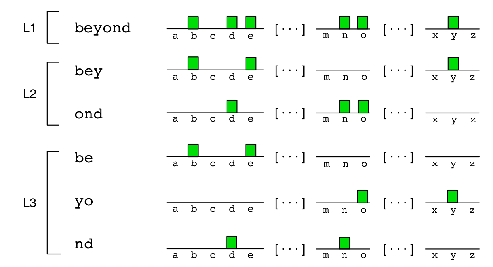
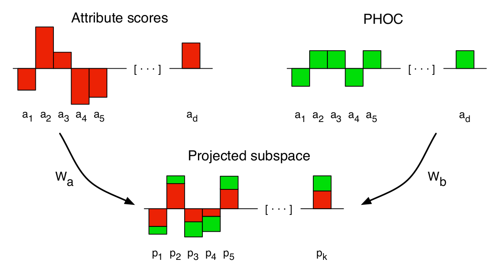
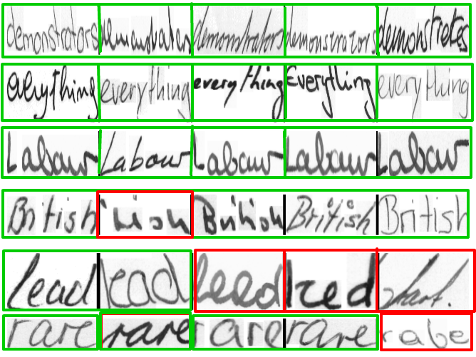
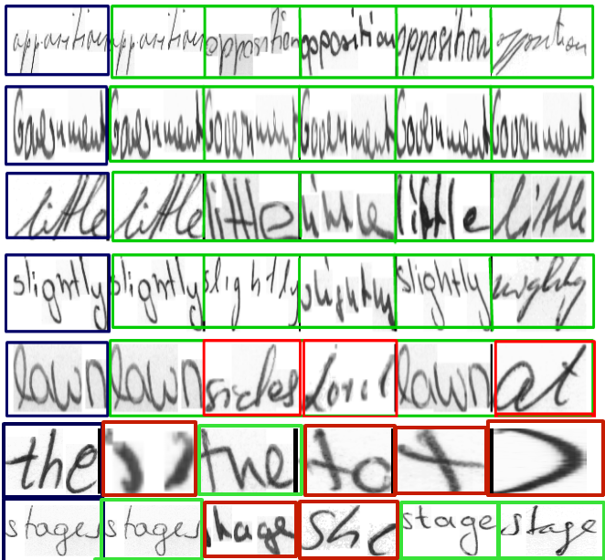

# Word Spotter
An implementation of Almazan's 2013 ICCV [paper](http://www.cvc.uab.es/~almazan/wp-content/uploads/2013/10/almazan_ICCV13.pdf)

# Abstract
The project’s focus is to provide an approach to multi-writer word spotting, where the goal would be to find a query word in a dataset comprised of document images. It is an attributes-based approach that leads to a low-dimensional, fixed-length representation of the word images that is fast to compute and, especially, fast to compare. This approach would lead to a unified representation of word images and strings, which seamlessly allow one to indistinctly perform query-by-example, where the query is an image, and query-by- string where the query is a string.

# Challenges with previous works
1. Out of Vocabulary words(words not there in training images, but exist in the test images)
2. Time taken for the image retrieval
3. Same word, different handwriting

# Objective
To find all instances of a given word in a potentially large dataset of document images. The various types of Queries to be handled are:
1. Query by example (Image)
2. Query by string (Text)

# Fisher Vector
1. A Gaussian Mixture Model (GMM) is used to model the distribution of features (e.g. SIFT) extracted all over the image
2. The Fisher Vector (FV) encodes the gradients of the log-likelihood of the features under the GMM, with respect to the GMM parameters.

# PHOC(pyramidal histogram of characters)
1. This binary histogram encodes whether a particular character appears in the represented word or not.
2. Spatial pyramid representation ensures that the information of the characters order is preserved.
3. PHOC representation is the concatenation of the partial histograms.

# Canonical Correlation Analysis
Technique to embed the attribute scores and the binary attributes in a common subspace where they are maximally correlated.

# Algorithm
1. SIFT features are densely extracted from the images over a 2x6 spatial grid and reduced to 62 dimensions with PCA
2. Normalized x and y coordinates are appended to the projected SIFT descriptors
3. Predict/train the PHOC attributes using a SVM classifier, given the FV
4. Since we have the image and string for a word, actual PHOC attributes can be found by using the string input
5. Using CCA (Canonical Correlation Analysis), get the projections of the predicted scores and the ground truth values
6. Use cosine similarity to compute the mean average precision

# Implementation Details
1. Used 1 million SIFT features over 2 x 6 spatial grid for training the GMM with 16 gaussians .
2. Used PCA to reduce dimensions to 64. Attribute dimensions are 2 × 64 × 192 = 24, 576. Descriptors are then power and L2- normalized. 
3. Used levels 2, 3 ,4 and 75 common  bigrams at level 2, leading to 384 dimensions considering the 26 characters of the English alphabet.
4. For learning the attributes we’ve used 39,756 (40%) images to train one vs rest SGD classifier. 
5. For CCA we’ve used 41,032 images to learn the common subspace. We’ve reduced the 384 dimensions to 196 dimensions in the process.
6. Testing was done on 13,329 images

# Results
The following are the results on IAM dataset.

## MAP scores 
| | Fisher Vector | Attributes | Attributes + CCA |
| :-----: | :-----: | :-----: | :-----: | 
| QBS | - | 0.42 | 0.48 |
| QBE | 0.11 | 0.28 | 0.37 |

## QBS

## QBE

# Contributers
1. Praveen Balireddy (praveeniitkgp1994@gmail.com)
2. Aman Joshi (amanjoshi668@gmail.com)
3. Abhijeet Panda (abhijeet.panda@students.iiit.ac.in)

For more details regarding the project, please refer to the "CV project report.pdf" in the repo.